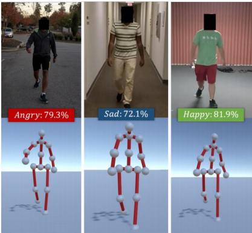

# FVAB_EmotionGate
<picture>
  <source srcset="./readmePhotos/EmotionGait.png" media="(min-width: 680px)">
    <p align="center">  
        
    </p>
</picture>

Table of contens
=============

* [Project Overview](#project-overview)
* [Model Architecture](#model-architecture)
* [Results](#results)
* [Future Work](#future-work)
* [Setup and Usage](#setup-and-usage)

Project for the exam of Fundamentals of Computer Vision and Biometrics in the first year of the master's degree in CyberSecurity.This project is an exploration of using Long Short-Term Memory (LSTM) networks for emotion recognition. The goal is to classify emotions based on video data, specifically focusing on facial expressions. 
This project is an exploration of the use of `Long Short-Term Memory (LSTM)` networks for emotion recognition. The goal is to classify emotions based on video data, particularly focusing on poses and the way people in the videos move.
The emotions we are trying to classify include happiness, sadness, anger, and neutral.
 
<picture>
  <source srcset="./readmePhotos/LSTM Unit.png" media="(min-width: 480px)">
  <p align="center">    
    
  </p>
</picture>

## Project Overview


<picture>
  <source srcset="./readmePhotos/WorkFlow.png" media="(min-width: 600px)">
  <p align="center">    
    
  </p>
</picture>

The project uses a combination of `Convolutional Neural Networks (CNNs)` and LSTMs to process and classify the video data. The CNNs are used to extract features from the video frames, and the LSTM is used to analyze the temporal aspects of the data.
The main steps involved in the project are:

 - **Data Preprocessing**: The video data is preprocessed by extracting frames and resizing them to a uniform size.

 - **Feature Extraction**: A CNN is used to extract features from the frames. The CNN is structured as a series of convolutional and max pooling layers.

 - **Sequence Analysis**: The extracted features are then fed into an LSTM network. The LSTM is capable of learning temporal dependencies, making it suitable for video data.

 - **Classification**: The output of the LSTM is then passed through a fully connected layer with a softmax activation function to classify the emotion.

<picture>
  <source srcset="./readmePhotos/Emotions.png" media="(min-width: 600px)">
  <p align="center">  
    
  </p>
</picture>

## Model Architecture

The model architecture is as follows:

- `TimeDistributed Conv2D` layer with 16 filters and a 3x3 kernel, followed by a ReLU activation function.
- `TimeDistributed MaxPooling2D` layer with a 2x2 pool size.
- `TimeDistributed Conv2D` layer with 32 filters and a 3x3 kernel, followed by a ReLU activation function.
- `TimeDistributed MaxPooling2D` layer with a 2x2 pool size.
- `TimeDistributed Flatten` layer to flatten the 3D outputs of the previous layer for the LSTM. LSTM layer with 32 units.
- `Dense layer` with 64 units, a ReLU activation function, and L2 regularization.
- `Output Dense layer` with a softmax activation function.

The model uses the `Adam` optimizer with a learning rate of 0.00007 and sparse categorical crossentropy as the loss function.

## Results

The model was trained and evaluated on a test set. The accuracy, precision, and F-score were calculated to evaluate the model's performance.

## Future Work

This project is a starting point for emotion recognition using LSTM networks. Future work could include:

- Using a larger and more diverse dataset to improve the model's generalization.
- Experimenting with different model architectures and hyperparameters.
- Incorporating other types of data, such as audio or physiological data, to improve the emotion recognition.

## Setup and Usage

To train the model, upload videos of people walking inside the root directory with name :"videos" for model training (file : `test_validation_model.py`)

Run the command to install the dependencies:
```
pip install -r requirements.txt
```
Then simply run the python reference file for model training:
```
python test_validation_model.py
```

Once this is done, the `.h5` file of the model just trained by the configuration in the file described above will be displayed.

Instead, to test the newly trained model, upload videos or people walking inside the root directory (as for training) with name :" videosTest"

Run the command to install the dependencies if you haven't already:
```
pip install -r requirements.txt
```
Then simply run the reference python file for testing the model:
```
python test_model.py
```
Once this is done, the data and statistics of accuracy, precision and the various details of the case will be displayed on the console.

